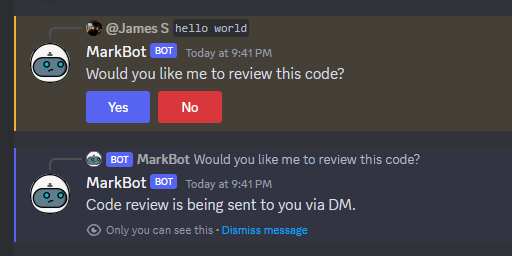

# MarkBot

## Description

A Chat GPT driven coding review discord bot. The app implements the openAI API and dicord API to create a useful code review tool that can be called in discord. Users can prompt the bot by sending a codeblock within upticks (` `) in discord servers that Mark bot is present. The bot will then offer to review the code, with the review being sent via direct message. The user can then continue to the converation with bot via Chat GPT driven interaction.

The bot is named Markbot after my bootcamp coding tutor Mark who has helped me in reviewing code countless times.

# Usage

You can join the following server to test the bot:

https://discord.com/channels/1192180321035243540

Althernatively, add the bot to a discord server of your own using the following URL:

https://discord.com/oauth2/authorize?client_id=1192178580839469186&permissions=8&scope=bot

Once MarkBot is seen as online in your server, send a message of some code in your server within upticks ` ` and you will recieve the option to review code. E.g `let sum = (a,b) => { a + b}`

A button menu will pop up and you will receive a DM with a review of your code. You can then interact with the bot in the DM chat and ask for clarification or further help. The bot is ChatGPT driven so the conversation can be taken in infinite directions with coding knowledge pulled from Open AI's extremely broad LLM.

## Testing

Tests written in mocha to test bot is online and to test logging of conversation with bot. These can be checked out by forking repo, installing all dependencies then running npm test.

## Deployment

The site is deployed on Heroku.

## Acknowledgments

- Open AI API
- Discord API
